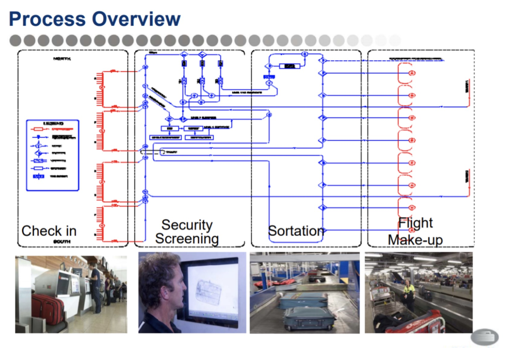
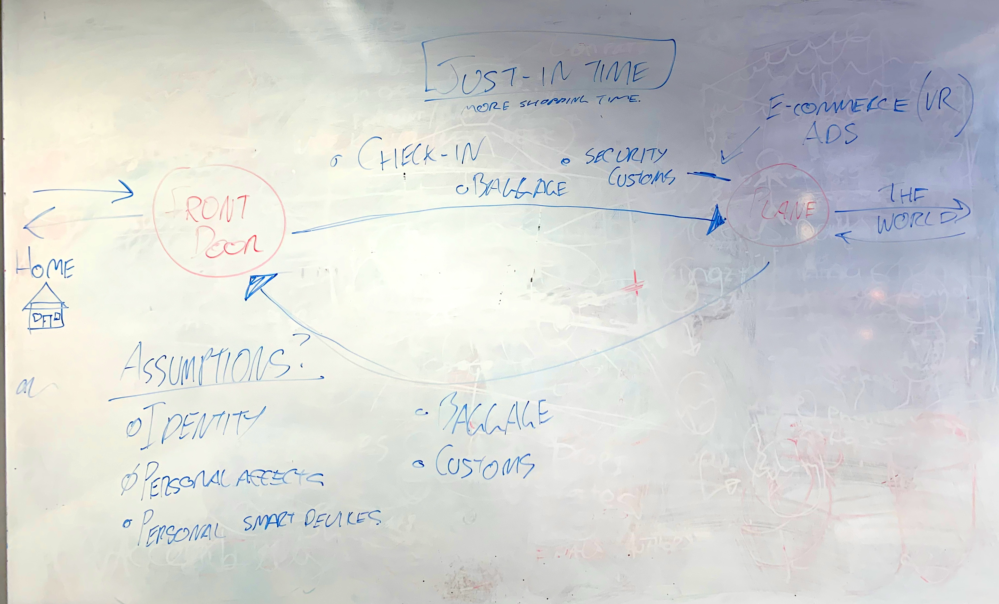
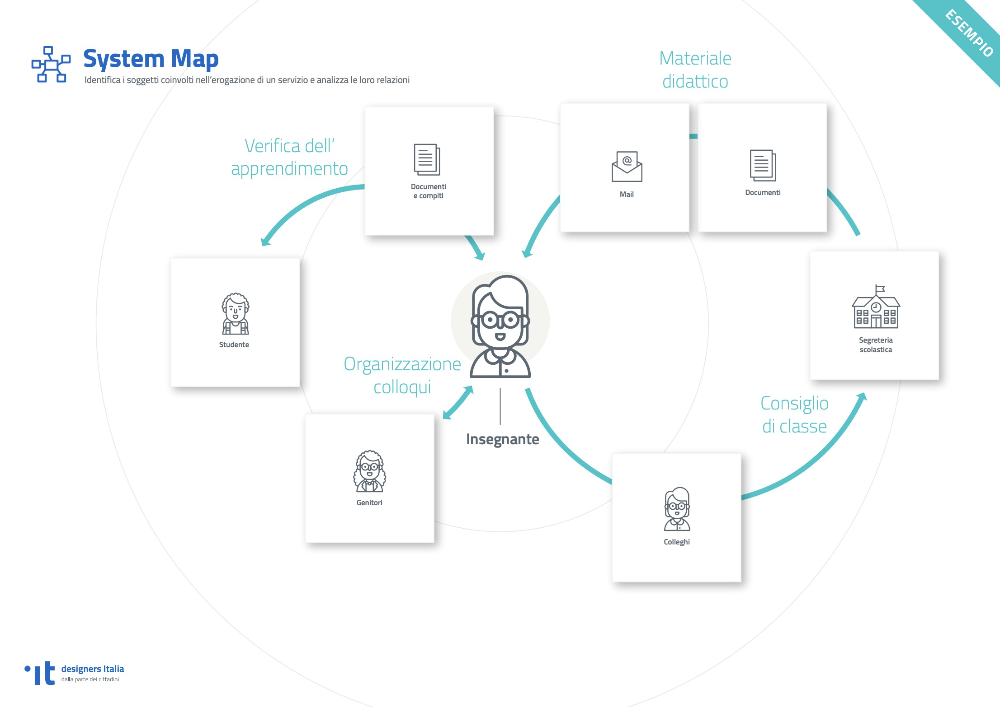
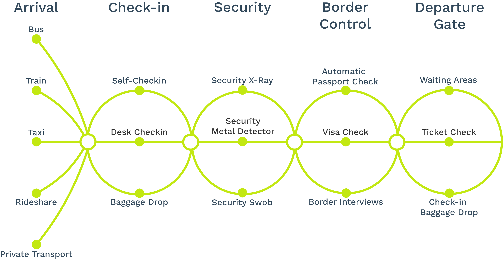
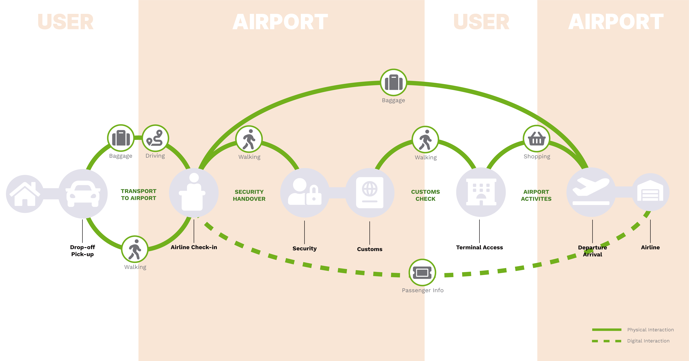
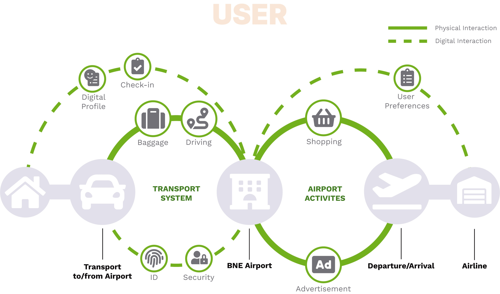

import Image from "next/image";

import portrait from "./portrait.jpg";
import iata_benchmark from "./iata-benchmark.jpg";

import ProjectInfo from "@/components/project/ProjectInfo";
import Section from "@/components/project/Section";

export const meta = {
  title: "System Mapping the BNE Airport.",
  date: "2019",
  tags: [
    "research",
    "mapping",
    "denim",
    "street",
    "fashion",
    "fabric",
    "casual",
    "industrial",
  ],
  description: "Mapping the BNE Airport user experience.",
  metaDescription: "Mapping the BNE Airport user experience.",
  clientName: "Queensland University of Technology",
};

<Section>
  <h1>a Title</h1>
  
asdffd f df f

  <ProjectInfo
    clientName="Queensland University of Technology"
    datePeriod="2022"
    bodyText="This project was completed over 12-months in the final year of my
  Industrial Design degree as my disertation project. The projects
  outcome incluced a reserach thesis and a developed product based on
  the reserach completed in the first 6 months of the project."
    tags={[
      "Advanced Research",
      "Model Making",
      "Sustainability",
      "Healthcare",
      "Medical",
      "Human-centered Design",
    ]}
  />
</Section>

<Image
  alt="hero image of the modclave"
  src={portrait}
  sizes="(min-width: 808px) 50vw, 100vw"
  className="off-width"
  placeholder="blur"
/>

To get rid of all the fluff to come - here's what I came up with. A system to get from your house to the plane, seamlessly without the torrential rain of friction points there is now.

# The Process

> At the time of writing this, all the details with regards to the process are still being marked at the university so pieces may be missing but hopefully I'll be able to get them in here when I get the chance.

### Stage 1 - The Old

Stage one of the project was to create and present a context capture video which included all the information and other materials that discuss and highlight the existing system with which we've chosen to recreate. See below for that video [link](./https://youtu.be/86vL4qtukUI).

YOUTUBE

The video, and the information discovered in the process of making it was the basis with which we as a team used to create our final product and subsequent system.

The process here allowed us to collect data by visiting the airport on multiple occasions. By using the use of information collection methods we captured wait times, drop-off frequencies, plane to bag carousel times and so on. This enabled us to find the key friction points within the larger system and identify why and how the slowdowns occur. In conjunction with the airport visit, I also managed to do a few interviews with existing and previous employees of the airport which exposed one glaring flaw that we heavily touched on, which was the lack of communication between systems (one airline would use a completely different system to another, etc).

<Image
  alt="IATA's benchmark infographic"
  src={iata_benchmark}
  sizes="(min-width: 808px) 50vw, 100vw"
  className="off-width"
  placeholder="blur"
/>

With secondary resources we also managed to find some insightful information with how systems talk to each other (more importantly the lack of communication), the requirements each airport must have and the benchmarks made internationally with regards to time effectiveness.

> Some of BNE's maps are pretty bad... What does this even mean?

### Stage 2 - The New

From here we planned out what we wanted, which in this case was to combine all the pre-check systems effectively into one system (with the timeline we had was possible - circa 2050).

So now what? Did we get it right? Well yeah, nahh - this where I came in because now we had to present it in a way that made sense to everyone at a glance. So here comes more research... Long story short, I kinda got lucky and found [`Designers Italia`](./https://designers.italia.it/assets/downloads/Designers_SystemMap_Esercizio.pdf) which gave a good outline that I thought, would be an effective way to show our old and new system.

> Thank goodness for google translate.

From here, it was relatively easy to represent. After some illustrator and font awesome icons later we arrived at our destination (After one attempt which was super lazy on my part.)

The aim of this one was to confuse, but it ended up being too much for that.

### The product

> Existing Map - orange parts was to highlight that the airport drives these areas and the user must wait for them (lines, security hold-ups, etc.)

> Proposed Map - New map, of the final system which was presented in front of the stakeholders.

Looking back at this, I think for the ideas we wanted to get across I achieved in an effective way, but other options weren't tried as much as it should have. Looking forward I'd be keen to try other methods to display large systems such as these.

Thankyou.

---

Feel free to hit me up with an email for any feedback at _isaac(at)isbonora.com_. (or any other feedback at all with regards to this website.)
